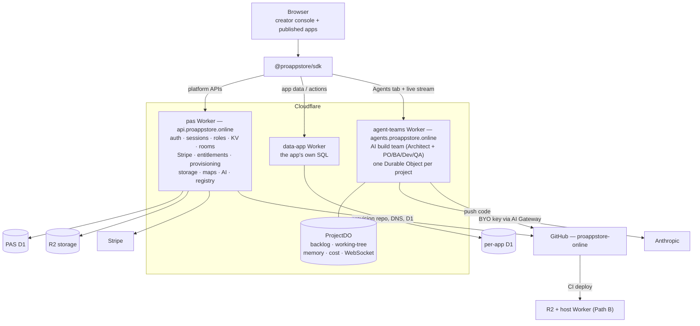
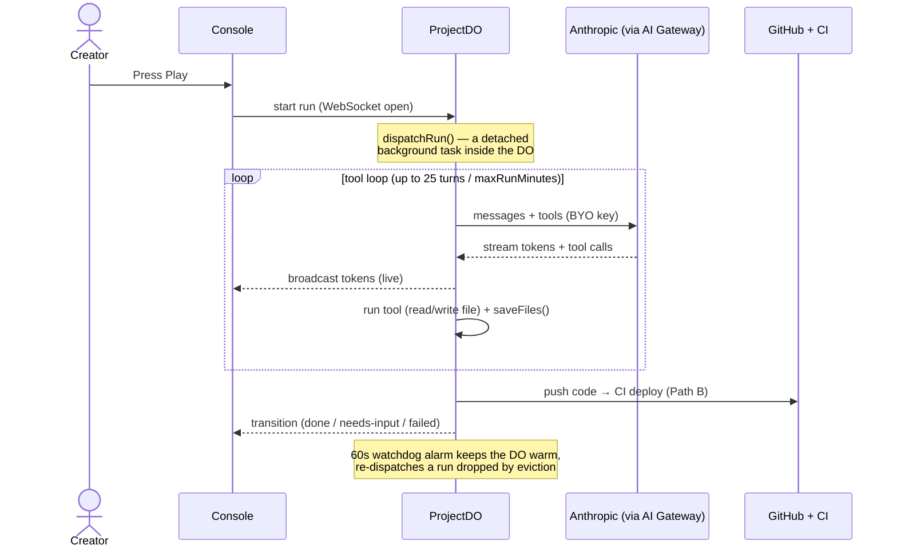

# Architecture

ProAppStore runs as a **single control plane composed of Cloudflare Workers**.
Apps published on the platform — Tailored or Ready — talk to PAS-owned APIs;
the only difference is which resources the publisher provisions and which SDK
helpers the app uses.

## System at a glance

Three Workers, each with a clear job. The browser only talks to them through the
SDK; everything else (D1, R2, Stripe, GitHub, Anthropic) sits behind a Worker.

### 1. `pas` Worker — platform API

Lives at `api.proappstore.online`. Source:
`~/dev/stores/pas/platform/packages/backend`.

- **Identity:** PAS-owned GitHub OAuth, Google OAuth, email magic links,
  provisioned credential accounts, and signed PAS sessions.
- **Per-user KV:** namespaced storage every app can use.
- **Rooms:** Durable Objects with WebSocket fan-out for cursors / presence
  / lightweight multiplayer.
- **Roles:** app-level owner/moderator/editor/viewer roles plus app-defined
  assignments.
- **Publishing/provisioning:** validates publish requests and provisions Pages,
  DNS, D1, data workers, and app metadata without a FAS admin proxy.
- **Stripe webhook receiver:** `subscription.created`, `updated`,
  `deleted`, `invoice.paid`, `customer.subscription.trial_will_end`.
- **Checkout & portal redirects:** open Stripe Checkout for a price,
  open the customer portal for an existing subscription.
- **Entitlements:** `subscriptions` table in PAS D1 keyed by
  `(appId, userId)`; the SDK reads `tier`, `priceId`, `currentPeriodEnd`.
- **License keys:** for offline / non-subscription paid features.
- **Proxy, storage, maps, AI, notifications, SMS, email, webhooks:** platform
  services exposed through the SDK.
- **Session validation:** verifies PAS session JWTs locally with
  `SESSION_SIGNING_KEY`.

D1 binding: `DB`. Migrations directory under `packages/backend/migrations`.

### 2. PAS provisioning — self-contained

> **Updated 2026-05-28 (PLAN-ARCH-CLEANUP Phase 4).** PAS no longer reuses
> the FAS admin Worker for provisioning. The legacy `[[services]] ADMIN =
> freeappstore-admin` binding was removed from
> `pas/platform/packages/backend/wrangler.toml` — no code path was actually
> calling it. PAS provisioning is fully self-contained in
> `pas/platform/packages/backend/src/routes/provision.ts`.

`POST /v1/provision` on `api.proappstore.online` is the mutating endpoint.
Given an app id, name, category, it creates the same chain as before, but
all the CF API + GitHub calls happen from the PAS Worker directly:

| Step | Action | Tailored | Ready |
|---|---|---|---|
| 1 | GitHub repo (in `proappstore-online` org) | yes (per fork) | yes (one for the publisher) |
| 2 | Host route via D1 routes table (Path B) | yes | yes |
| 3 | Storefront registry entry | yes | yes |
| 4 | **D1 database** | **yes (per fork)** | no (publisher BYO) |

Step 4 is the meaningful branch and the work item that unblocks any
non-toy Tailored template. See [publishing flow](/publishing-flow).

The standalone `proappstore-admin` Worker (source: `~/dev/stores/pas/admin`)
is a separate dashboard endpoint at `admin.proappstore.online` that
exposes `/api/publish-app` for owner-driven catalog edits — it's not on
the CLI publish path.

Auth: PAS platform validates its own signed PAS sessions with
`SESSION_SIGNING_KEY`. No CF Access on `api.proappstore.online`.

### 3. `agent-teams` Worker — AI build team

A team of AI agents (PO / BA / Dev / QA) that builds and maintains an app from a
founder's chat. One Durable Object per project holds the backlog, the working-tree
cache, project memory, cost ledger, and the live WebSocket. GitHub is the source
of truth — the DO syncs from it before each run and pushes back via the `admin`
Worker. Agents run on the user's **BYO key** (our own in-Worker loop, streamed,
with prompt caching). Deployed at `agents.proappstore.online`; UI in the creator
console's per-app **Agents** tab.

Full detail: [`packages/agent-teams/README.md`](https://github.com/proappstore-online/platform/blob/main/packages/agent-teams/README.md)
and [Agent Teams: runtime & billing](/agent-teams-runtime-and-billing).

## How an agent build actually runs

This is the part most people need to picture. **Each project is one Durable
Object (the `ProjectDO`)** — think of it as a tiny always-on mini-server dedicated
to that one app. It holds the backlog, the working-tree of files the agents are
editing, project memory, the cost ledger, and the live WebSocket to the browser.

When the creator presses **Play**, the DO dispatches an agent run *inside itself*
and streams every token to the browser as it's generated.

**Why the watchdog + locks exist.** Cloudflare can put a DO to sleep when it
looks idle. Because the run lives in the DO's memory, the system hand-builds a
safety net so a long run survives: a **60-second watchdog alarm** restarts a
dropped run, **in-memory locks** stop two copies running at once, **stale-lock
self-heal** recovers a leaked lock, and **re-dispatch** resumes from the
last-saved files. Files are saved after every write, so a crash loses at most the
current step.

This works, but it's effectively a **durable-execution engine built by hand** —
which is why the long-run edges are the fragile part. The durable *deploy* step
already moved to Cloudflare Workflows ([ADR-007](/adr/007-durable-provisioning-workflow));
whether the *run* should follow is the open architectural question.

## Why one control plane

Identity, registry, billing, provisioning, and entitlements are the same
problem regardless of whether an app is Tailored or Ready. What differs
is *what publishers do with their own app code* — and that lives in the
SDK + CLI scaffolds, not in a separate backend. Adding a fourth Worker
per category would be over-engineering. See
[ADR-003](/adr/003-one-control-plane).

## Worker-to-worker pattern

PAS provisioning is self-contained in the platform backend. When a published app
needs its own data plane, the backend creates the app D1 database and deploys a
`data-<app>.proappstore.online` worker with that database bound as `DB` and the
PAS `SESSION_SIGNING_KEY` injected as a secret. The data worker verifies caller
sessions locally; it does not call a separate auth service for every request.

Browser-facing app data uses registered app actions, not arbitrary raw SQL
from the browser. Actions are declared in `mcp.json`, stored in the platform
`app_tools` table, executed through `/v1/apps/:appId/actions/:name`, and then
forwarded as prepared SQL to the app data worker. The action executor injects
the verified PAS user id and enforces declared platform/app roles before any app
SQL runs. The low-level `app.db` raw SQL API is restricted by the data worker to
the app's team (creator + team members) — it is the schema/admin escape hatch,
not a user-facing permission boundary. See
[app actions security](/app-actions-security) for the guard idioms and the
atomic batch-tool form.

### Same-zone subrequests: service bindings are MANDATORY

Cloudflare does not route a Worker's `fetch()` to another Worker whose hostname
is a **route** on the same zone — the request silently goes to the origin DNS
record instead. On 2026-07-10 this took down every app's data plane: the data
worker's authorization fetch to `api.proappstore.online` never arrived, and the
fail-closed check returned 403 to every caller.

Rules, enforced across the codebase:

- Any worker→worker call within `proappstore.online` goes over a **service
  binding** (`[[services]]` in wrangler.toml, `env.NAME.fetch(...)`). This
  includes a worker calling its own route-mapped hostname (backend uses a
  `SELF` binding for internal re-entry).
- Workers **custom domains** (the `data-<app>` hostnames) ARE reachable by
  subrequests — that asymmetry is why host→data works while data→api did not.
- Pages origins (the storefront apex) are also reachable by subrequests.
- Current bindings: host→API, data-workers→API, mcp→API/AGENTS/ADMIN/HOST,
  agent-teams→PAS_BACKEND/ADMIN/KB, backend→SELF.

## Database

| DB | Worker | Purpose |
|---|---|---|
| PAS platform D1 (`DB`) | `api.proappstore.online` | users, apps, roles, sessions metadata, KV/counters, subscriptions, license keys, app-tool manifests, usage |
| per-app D1 (`DB`) | `data-<app>.proappstore.online` | the app's own SQL data |

The platform database and app databases stay separate. App UI should call
registered actions for user/role-scoped app rows; MCP calls use the same
registered manifest surface. Platform APIs stay on the PAS backend.

## What this doesn't include

- A workflow / rules engine. Per-app business logic is per-app code.
- An admin UI for structural config. Source-code customization with AI
  is the customization story (see [tailored vs ready](/tailored-vs-ready)).
