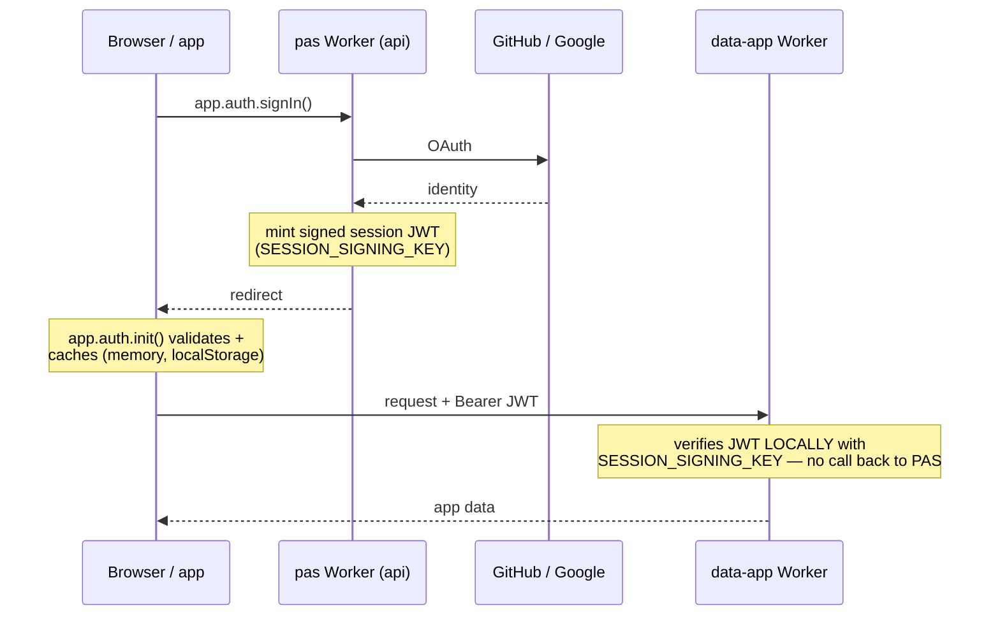

# Browser Auth Session Model

PAS owns browser auth for apps. App code should use the SDK auth APIs and should
not store, copy, or parse PAS session tokens itself.

## Current State

The current SDK still supports the legacy bearer-token browser flow:

1. `app.auth.signIn()` sends the browser to `api.proappstore.online`.
2. PAS completes GitHub or Google OAuth.
3. The backend redirects to the app with `#pas_session=<token>`.
4. `app.auth.init()` validates the token, stores the signed-in user in memory,
   and tries to cache the session under `pas:session`.



> The key property: every worker (backend **and** each `data-<app>`) verifies the
> JWT **locally** with the same PAS signing key (`SESSION_SIGNING_KEY`) — there is
> no per-request round-trip to an auth service, and **no dependency on FAS**: PAS
> mints and verifies its own sessions with its own key + OAuth apps. The open work
> (below) is moving the browser-side token off JS-readable storage into a
> host-only `__Host-` cookie.

> **Operational invariant (learned the hard way — see #65/#66):** every
> `data-<app>` worker must hold the **current** `SESSION_SIGNING_KEY`. The backend
> pushes it at provision time; if a data worker's key drifts from the backend's
> (e.g. after a key rotation or a broken provision), it will `401` a perfectly
> valid session. Reconcile the fleet with the **Redeploy data workers** workflow
> (`redeploy-data-workers.yml`, whole-fleet `workflow_dispatch`), which re-pushes
> the key to every worker. Correspondingly, the host mediation only clears the
> `__Host-pas_session` cookie on an **API-plane** 401 (the backend is the session
> authority) — a **data-plane** 401 surfaces as a data error and never signs the
> user out, so key drift can't cascade into a forced sign-out.

As of `@proappstore/sdk@1.16.23`, storage access is defensive. If
`localStorage` is blocked, throws, or is unavailable, the SDK keeps the
validated session in memory for the current page lifetime instead of failing the
sign-in. This is a compatibility fix, not the final security model.

The legacy persistent cache remains a bearer token that browser JavaScript can
read. That is not the desired long-term model.

## Target Model

Hosted PAS apps should use a same-origin token-handler flow:

```text
Browser on app origin
  |
  | app.auth.signIn()
  v
/.pas/auth/start on the same app origin
  |
  | redirects through PAS OAuth
  v
/.pas/auth/callback on the same app origin
  |
  | sets host-only HttpOnly Secure SameSite cookie
  v
App calls SDK APIs through same-origin PAS mediation
  |
  | host/token-handler adds internal Authorization bearer
  v
api.proappstore.online and data-<app>.proappstore.online
```

Important constraints:

- Do not set a broad `Domain=.proappstore.online` session cookie.
- Use host-only `__Host-...` cookies on the actual app hostname.
- Browser JavaScript should not receive or persist the PAS bearer token.
- Backend and data workers can continue verifying PAS bearer tokens internally.
- Cookie-authenticated write requests need CSRF and origin checks.

## Custom Domains

The same model must work for both platform subdomains and app-owned custom
domains:

- `https://<app>.proappstore.online`
- `https://app.example.com`

For a custom domain, the session cookie must be set on `app.example.com`
itself. That only works if requests for the custom domain pass through a
PAS-controlled Worker path that can set and read the host-only cookie.

Before token-handler auth becomes the default, confirm the custom-domain serving
path is aligned with the current R2 host-worker architecture. Any remaining
Cloudflare Pages custom-domain path must be migrated or wrapped so authenticated
apps are still served through `proappstore-host` or an equivalent PAS-controlled
Worker.

## Implementation Plan

### Phase 1: SDK Storage Hardening

Status: started.

- Wrap session `localStorage` reads, writes, and removals in `try/catch`.
- Keep validated sessions memory-only when storage fails.
- Preserve legacy behavior when storage works.
- Add regression tests for blocked storage during restore, callback, and
  sign-out.

### Phase 2: Host-Worker Token Handler

Status: started.

Add reserved same-origin routes before static app serving:

- `/.pas/auth/start`
- `/.pas/auth/callback`
- `/.pas/auth/me`
- `/.pas/auth/logout`

The callback should set a host-only HttpOnly Secure SameSite cookie and then
redirect to the clean app URL without `#pas_session` or `?session`.

Implemented foundation:

- `/.pas/auth/start` redirects through PAS OAuth with `response_mode=query`.
- `/.pas/auth/start` sets a host-only HttpOnly nonce cookie.
- `/.pas/auth/callback` requires the nonce cookie before accepting a session.
- `/.pas/auth/callback` verifies the session with PAS API before setting the
  host-only `__Host-pas_session` cookie.
- `/.pas/auth/me` reads the HttpOnly cookie server-side and returns the PAS user.
- `POST /.pas/auth/logout` clears the session cookie and rejects cross-site
  mutation signals.
- `/.pas/auth/*` is reserved before R2 static serving, so app files cannot
  shadow platform auth routes.
- Active custom domains can resolve back to their app route when they are served
  through PAS-controlled hosting.

Remaining: make the SDK use these endpoints by default once same-origin API
mediation is available.

### Phase 3: Same-Origin API Mediation

Status: started.

Add same-origin SDK API mediation for endpoints that currently require browser
JavaScript to send `Authorization: Bearer <token>`.

The host/token-handler should:

- read the app-origin HttpOnly cookie
- verify or exchange it server-side
- call platform API and data-worker routes with internal bearer auth
- preserve existing app/user/role enforcement

Implemented foundation:

- `/.pas/api/*` forwards to `api.proappstore.online/*`.
- `/.pas/data/*` forwards to the current app's own data worker.
- Both mediation paths require the host-only `__Host-pas_session` cookie.
- Mutating mediated requests reject cross-site `Origin` / `Sec-Fetch-Site`
  signals before reaching the upstream worker.
- Caller-supplied `Authorization` and `Cookie` headers are stripped before the
  host worker injects the internal bearer token.
- WebSocket room upgrades use `/.pas/api/v1/apps/:appId/rooms/:roomId`
  mediation; the host worker reads the HttpOnly cookie and forwards the upgrade
  to the API binding with an injected bearer token.

### Phase 4: SDK Migration

Status: started.

Hosted apps can opt into token-handler mode:

```ts
const app = initPro({
  appId: 'my-app',
  authMode: 'platform-cookie',
})
```

In `platform-cookie` mode:

- `app.auth.signIn()` starts OAuth at `/.pas/auth/start`.
- `app.auth.init()` reads the user from `/.pas/auth/me`.
- `app.auth.signOut()` posts to `/.pas/auth/logout`.
- Normal SDK HTTP modules use same-origin `/.pas/api/*` or `/.pas/data/*`
  mediation instead of JavaScript-readable bearer tokens.
- `app.usage` sends normal heartbeats and pagehide beacons through same-origin
  `/.pas/api/v1/usage/ping` mediation, so unload telemetry can use the
  HttpOnly app cookie without exposing a bearer token to JavaScript.
- `app.rooms` connects through same-origin `/.pas/api/*` WebSocket mediation
  instead of putting the session token in the URL query string.
- `app.maps.geocode()`, `app.maps.route()`, and `app.maps.reverseGeocode()`
  use authenticated same-origin API mediation in cookie mode. `embedUrl()` and
  `staticUrl()` remain public OpenStreetMap URL helpers.

The compatibility default remains `legacy-bearer` until all SDK paths are
covered and real hosted apps have passed end-to-end verification.

Keep explicit fallback modes for compatibility:

- `platform-cookie`: same-origin token-handler mode
- `legacy-bearer`: current localStorage-backed bearer mode

**Verified so far:** `platform-cookie` sign-in + `/.pas/auth/me` are confirmed
working end-to-end on hosted apps (`interns`, `chess-academy`) for **both GitHub
and Google**, once the signing-key drift blocker (#65/#66) was resolved. Only
`interns` currently ships in `platform-cookie` mode; the rest of the fleet is
still on `legacy-bearer`.

Remaining before defaulting hosted apps to cookie mode: end-to-end verification
of the remaining mediated paths (app **data**, **rooms**, **usage**, **maps**,
**sign-out**) in cookie mode, then migrating the rest of the fleet off
`legacy-bearer` (#20).

### Phase 5: Security Gates

Before cookie mode becomes default:

- enforce same-origin `Origin` checks on mutating routes
- use `Sec-Fetch-Site` where available
- add CSRF protection where Origin/Fetch-Metadata is insufficient
- avoid broad credentialed CORS across `*.proappstore.online`
- add tests for cross-app and custom-domain cookie isolation

## App Author Rules

Apps should:

- call `app.auth.signIn()`, `app.auth.signOut()`, and `useProAuth()`
- use SDK primitives for database, storage, roles, proxy, and services
- let PAS own OAuth callbacks and session persistence

Apps should not:

- store PAS tokens in `localStorage`, `sessionStorage`, IndexedDB, or cookies
- parse `#pas_session` or `?session` in app code
- create app-specific OAuth callback workarounds
- pass PAS tokens to third-party services

## Acceptance Criteria

- Browser apps can sign in without storing PAS bearer/session tokens in
  JavaScript-readable persistent storage.
- Safari/private-storage GitHub and Google sign-in remain signed in after the
  redirect.
- `*.proappstore.online` apps use host-only HttpOnly Secure SameSite cookies or
  equivalent token-handler storage.
- BYO custom-domain apps get the same behavior on their own hostname.
- No broad `Domain=.proappstore.online` session cookie is introduced.
- Cookie-authenticated write paths have CSRF and origin protections.
- SDK and public docs clearly state where session state lives in hosted apps,
  custom-domain apps, local dev, and fallback modes.
