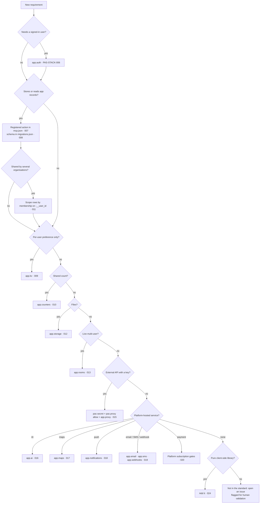

# Stack and platform services

**Standard version 1.6** · Chapter `STACK` · Part of the [Application Standard](./index.md)

**Scope.** Supported runtime and toolchain; SDK and CLI use; the platform service to use for each application need, and the substitutes that are unsupported.

Clause IDs in this chapter have the form `PAS-STACK-<NNN>`; see the
[clause ID grammar](./governance.md#clause-id-grammar). Each clause follows the
[clause template](./governance.md#clause-template) and is audited under the
[audit model](./audit-model.md). Clauses here decide *which* primitive an app
uses; the detailed rules for using each one live in the
[AUTH](./auth.md), [DATA](./data.md), [INT](./integrations.md), [UI](./ui.md)
and [OPS](./ops.md) chapters.

## Required and optional stack elements

| Element | Status | Where it is set | Clause |
|---|---|---|---|
| TypeScript, Node ≥ 22, pnpm (pinned `packageManager`) | **Required** | root `package.json` | [PAS-STACK-001](#pas-stack-001) |
| Scaffold from `proappstore-online/template-app` via `pas create` | **Required** | repository layout: `web/`, `mcp.json`, `migrations.json`, `.github/workflows/` | [PAS-STACK-001](#pas-stack-001) |
| `@proappstore/sdk`, one `initPro` instance | **Required** | `web/src/lib/app.ts` | [PAS-STACK-002](#pas-stack-002), [PAS-STACK-003](#pas-stack-003) |
| `authMode: 'platform-cookie'` | **Required** for apps using the proxy; expected for all hosted apps | `initPro` options | [PAS-STACK-003](#pas-stack-003) |
| `pas` CLI for publish, secrets, proxy rules, domains | **Required** | developer workflow | [PAS-STACK-004](#pas-stack-004) |
| Template deploy workflow (keyless OIDC → R2) | **Required** | `.github/workflows/deploy.yml` | [PAS-STACK-005](#pas-stack-005) |
| Platform identity (`app.auth`) | **Required** where users sign in | SDK | [PAS-STACK-006](#pas-stack-006) |
| Registered actions in `mcp.json` | **Required** where the app stores data | repo root | [PAS-STACK-007](#pas-stack-007) |
| `migrations.json` | **Required** where the app has a D1 schema | repo root | [PAS-STACK-008](#pas-stack-008) |
| Runtime monitoring (`app.logs`, on by default) | **Required** | `initPro` options | [PAS-STACK-021](#pas-stack-021) |
| SDK UI components and design tokens; store link | **Required** tokens and link; components recommended | `web/` | [PAS-STACK-022](#pas-stack-022) |
| React 19 + Vite 8 + Tailwind 4 | **Optional** (template choice) | `web/` | [PAS-STACK-001](#pas-stack-001) |
| KV, counters, storage, rooms, roles, proxy, AI, maps, notifications, email/SMS/webhooks, subscription gates, MCP | **Optional capabilities** — but when the need exists, the platform primitive is the required way to meet it | SDK modules | [PAS-STACK-009](#pas-stack-009) – [PAS-STACK-023](#pas-stack-023) |
| `e2e/` Playwright suite | **Optional** | runs after deploy | [PAS-STACK-005](#pas-stack-005) |
| Custom domain | **Optional** | `pas domain add` | [PAS-STACK-004](#pas-stack-004) |

## Choosing a platform service

Start from the requirement, not from a library. Each row names the primitive
the app is expected to use, the substitutes that are unsupported, and the
clause that says why.

| The app needs to… | Use | Do not use | Clause |
|---|---|---|---|
| Know who the user is | `app.auth`, `useProAuth`, `ProShell` | Firebase/Auth0/Supabase/Clerk auth, own passwords or JWTs | [006](#pas-stack-006) |
| Read and write its own records | Registered actions (`mcp.json`, `app.actions.call`) | Firestore, Supabase, Mongo, raw `app.db.*` in user code | [007](#pas-stack-007), [011](#pas-stack-011) |
| Define or change its schema | `migrations.json` (additive, applied on deploy) | Runtime `CREATE TABLE`, `DROP`, hand-run `wrangler d1` | [008](#pas-stack-008) |
| Remember a user's preferences | `app.kv` | `localStorage` for identity or shared data | [009](#pas-stack-009) |
| Count things across users | `app.counters` | Read-modify-write on KV or D1 | [010](#pas-stack-010) |
| Keep organisations' data apart | Membership sub-queries on `:__user_id`; `app.db.tenant()` | Client-supplied tenant id as the only filter | [011](#pas-stack-011) |
| Store files | `app.storage` | Base64 in D1/KV, S3/Cloudinary with client keys | [012](#pas-stack-012) |
| Show live presence, chat, cursors | `app.rooms` | Pusher/Ably/Socket.IO servers, Firebase RTDB | [013](#pas-stack-013) |
| Let some users do more than others | `app.roles` + `auth.app_roles` in `mcp.json` | Hard-coded id lists, client-only checks | [014](#pas-stack-014) |
| Call an external API with a key | `pas secret set` + `pas proxy allow` + `app.proxy.fetch` | Keys in `VITE_*`, `.env.production`, source | [015](#pas-stack-015) |
| Generate text, chat, embed | `app.ai`; BYO provider through the proxy | Provider SDK in the browser with a key | [016](#pas-stack-016) |
| Show a map or resolve an address | `app.maps` | Google Maps / Mapbox keys in the client | [017](#pas-stack-017) |
| Notify users when away | `app.notifications` | OneSignal, FCM client SDKs | [018](#pas-stack-018) |
| Send email, SMS, webhooks | `app.email`, `app.sms`, `app.webhooks` | SendGrid/Resend/Twilio from the browser | [019](#pas-stack-019) |
| Charge for Pro features | Platform subscription: `useProGate`, `GateScreen`, `app.license` | Own Stripe/Paddle checkout, per-app prices | [020](#pas-stack-020) |
| See failures in production | `app.logs` (auto) | GA/Mixpanel/PostHog/Sentry-style trackers | [021](#pas-stack-021) |
| Look like a ProAppStore app | `@proappstore/sdk/ui`, design tokens | Brand overrides, custom fonts | [022](#pas-stack-022) |
| Let an AI agent operate it | The same `mcp.json` actions via `mcp.proappstore.online` | A second agent API or own MCP server | [023](#pas-stack-023) |
| Add a library | Pure client-side libraries without network credentials | Any substitute in the table above | [024](#pas-stack-024) |
| Run code on a schedule, hold server-authoritative state, bind services | Pro-tier platform capabilities — see the [Data chapter](./data.md) | Own Workers deployed with `wrangler` | [004](#pas-stack-004) |

## App-architecture decision tree



Whatever branch is taken: identity is `app.auth`, errors go to `app.logs`, the
UI uses the SDK components and tokens, the app deploys through the template
workflow, and agents reach it through the same `mcp.json`.

## Capability pages this chapter builds on

Clauses link to these as *Supporting links*; they describe what the platform
provides and are not restated here.

- [Architecture](../architecture.md)
- [Getting started](../getting-started.md)
- [SDK overview](../sdk-overview.md)
- [UI components](../ui.md)
- [Recipes](../recipes.md)
- [CLI overview](../cli-overview.md)
- [Publishing flow](../publishing-flow.md)
- [App actions and data access security](../app-actions-security.md)
- [MCP app tools](../mcp-app-tools.md)
- [ADR-001 Cloudflare Workers only](../adr/001-cloudflare-workers-only.md)

## Clauses

### PAS-STACK-001 — The app is a TypeScript, Node 22, pnpm project scaffolded from the platform template {#pas-stack-001}

**Severity:** Medium · **Verification:** Manual · **Enforcement:** none (recommended) · **Since:** 1.1

**Rule.** The app MUST be a TypeScript project with `"engines": { "node": ">=22" }` and a pinned `packageManager: pnpm@…`, created with `pas create` from `proappstore-online/template-app`. It MAY use any UI framework; React 19 + Vite 8 + Tailwind 4 is the template's choice, not a requirement.

**Applicability.** All apps.

**Rationale.** The deploy workflow, compliance checks, the CLI and the SDK are exercised against this toolchain. A hand-rolled project misses the workflows, `migrations.json`, `mcp.json` and `CLAUDE.md` the template ships, and each missing piece becomes its own audit failure.

**Recommended implementation.** Run `pas create <app-id>` (see [CLI overview](../cli-overview.md#create)); the template comes from the [approved-template catalogue](../templates/index.md), which records the copied revision on the app. Keep the root `package.json` `engines`, `packageManager` and the `prebuild` compliance hook the template generates. Swap the frontend framework inside `web/` if you wish; keep `web/dist` as the build output the deploy workflow locates.

**Conforming example.**

```json
{
  "packageManager": "pnpm@10.30.3",
  "engines": { "node": ">=22" },
  "scripts": { "prebuild": "npx -y @proappstore/cli@latest check", "build": "pnpm --filter @my-app/web build" }
}
```

**Non-conforming example.**

```json
{
  "engines": { "node": "18" },
  "scripts": { "build": "webpack --mode production", "deploy": "wrangler pages deploy dist" }
}
```

**Evidence.** Configuration: root `package.json` (`engines`, `packageManager`, `prebuild`); `pnpm-lock.yaml` committed; `web/vite.config.ts` or equivalent producing `web/dist`.

**Remediation.** Re-scaffold with `pas create` into a fresh directory and move the app source into `web/src/`, or add the missing `engines`, `packageManager`, `prebuild` and lockfile to the existing repo.

**Tests.** `pnpm install --frozen-lockfile && pnpm build` succeeds on Node 22 and produces `web/dist/index.html`.

**Supporting links.** [Getting started — tech stack](../getting-started.md#tech-stack), [SDK overview — framework-agnostic](../sdk-overview.md#framework-agnostic-on-purpose), [CLI overview](../cli-overview.md).

### PAS-STACK-002 — All platform access goes through @proappstore/sdk {#pas-stack-002}

**Severity:** High · **Verification:** Manual · **Enforcement:** none (recommended) · **Since:** 1.1

**Rule.** The app MUST call platform services only through `@proappstore/sdk`. It MUST NOT call `api.proappstore.online`, `data-<app>.proappstore.online` or `/.pas/*` routes with its own `fetch`, and MUST NOT read, store or forward platform session tokens itself.

**Applicability.** All apps.

**Rationale.** The SDK is where auth transport, retries, error capture and the platform-cookie mediation live. A hand-written `fetch` bypasses all of it: it needs the bearer in JavaScript (which platform-cookie mode deliberately withholds), it breaks when a route moves, and it is invisible to `app.logs`.

**Recommended implementation.** Import `initPro` once and use the module for each need (`app.auth`, `app.actions`, `app.kv`, …). The SDK is plain browser ESM with types and pins no framework.

**Conforming example.**

```ts
import { initPro } from '@proappstore/sdk'
export const app = initPro({ appId: 'my-app', authMode: 'platform-cookie' })
const rows = await app.actions.call('list_items', { limit: 20 })
```

**Non-conforming example.**

```ts
const token = localStorage.getItem('pas:session')
const res = await fetch('https://data-my-app.proappstore.online/query', {
  headers: { Authorization: `Bearer ${token}` }, method: 'POST', body: JSON.stringify({ sql }) })
```

**Evidence.** Source: `web/src/**` — every occurrence of `proappstore.online`, `/.pas/`, `pas:session`, `Authorization:` outside the SDK; `web/package.json` lists `@proappstore/sdk`.

**Remediation.** Replace each direct call with the SDK module that owns it (the table under [Choosing a platform service](#choosing-a-platform-service) maps needs to modules). Delete any token handling.

**Tests.** `grep -rn "proappstore.online\|/.pas/\|pas:session" web/src` returns only the store link the compliance check requires (see [Store link](#pas-stack-022)) and no `fetch` calls.

**Supporting links.** [SDK overview](../sdk-overview.md), [Browser auth session model — app author rules](../auth-session-model.md#app-author-rules).

### PAS-STACK-003 — One initPro instance, named after the repository, with platform-cookie auth {#pas-stack-003}

**Severity:** High · **Verification:** Manual · **Enforcement:** none (recommended) · **Since:** 1.1

**Rule.** The app MUST create exactly one `initPro({ appId })` instance in a shared module, with `appId` equal to the GitHub repository name (which is the subdomain). Hosted apps SHOULD pass `authMode: 'platform-cookie'`; an app that uses `app.proxy` MUST.

**Applicability.** All apps.

**Rationale.** Two instances mean two auth states and two monitoring queues. A wrong `appId` addresses another app's data plane. The legacy bearer mode exposes the session token to page JavaScript; platform-cookie mode keeps it in an HttpOnly cookie, and the secret proxy only answers calls mediated through the app's own origin.

**Recommended implementation.** Create `web/src/lib/app.ts` exporting the single instance; import it everywhere. Set `authMode: 'platform-cookie'`. Do not set `proApiBase` or `dataApiBase` in production code.

**Conforming example.**

```ts
// web/src/lib/app.ts
import { initPro } from '@proappstore/sdk'
export const app = initPro({ appId: 'my-app', authMode: 'platform-cookie' })
```

**Non-conforming example.**

```ts
// in three different components:
const app = initPro({ appId: 'myapp' })          // wrong id, legacy bearer, and a second instance
```

**Evidence.** Source: all `initPro(` call sites (`grep -rn "initPro(" web/src`); the `appId` literal versus the repository name; the `authMode` option.

**Remediation.** Move the call into one module, fix `appId`, add `authMode: 'platform-cookie'`, and verify sign-in still works (the platform-cookie flow uses `/.pas/auth/*`).

**Tests.** Exactly one `initPro(` call site; `app.auth.usesPlatformCookie === true` at runtime; sign-in and one data call succeed on `https://<app>.proappstore.online`.

**Supporting links.** [SDK overview — init](../sdk-overview.md#init), [Auth session storage](../sdk-overview.md#auth-session-storage), [Identity chapter](./auth.md).

### PAS-STACK-004 — App lifecycle runs through the pas CLI and the platform, never through manual infrastructure {#pas-stack-004}

**Severity:** High · **Verification:** Manual · **Enforcement:** none (recommended) · **Since:** 1.1

**Rule.** The app MUST be provisioned with `pas publish` (or the creator console) and MUST NOT create or modify Cloudflare resources, GitHub repositories, DNS or custom domains by hand. `wrangler deploy`, `wrangler d1 …`, `gh repo create` and Cloudflare Pages projects are unsupported for apps.

**Applicability.** All apps.

**Rationale.** The platform's registry is the source of truth for routing, D1 binding, custom domains and payouts. A resource created outside it is drift: the symptom is a Cloudflare 1014 on the domain, a data worker with no app record, or an app the store cannot pay out.

**Recommended implementation.** `pas login` → `pas create` → `pas publish` → `git push`. Custom domains via `pas domain add`. Secrets via `pas secret set`. Nothing else touches infrastructure.

**Conforming example.**

```bash
pas publish --name "My App" --category productivity
pas domain add app.example.com && pas domain verify app.example.com
```

**Non-conforming example.**

```bash
wrangler d1 create my-app-db
wrangler deploy --name my-app-api
gh repo create my-org/my-app --private
```

**Evidence.** Configuration: presence of `wrangler.toml` at the app root, `wrangler` in `package.json` dependencies or scripts, a `deploy:` script that is not the template workflow; Runtime: `https://<app>.proappstore.online` resolves and serves the app.

**Remediation.** Remove the manual resources and scripts; run `pas publish` to (re)provision; if a data worker or domain already exists outside the registry, ask platform support to reconcile rather than re-creating it.

**Tests.** `pas publish` reports every step `ok` or `skip`; no `wrangler` dependency; `curl -sI https://<app>.proappstore.online` returns 200.

**Supporting links.** [CLI overview](../cli-overview.md), [Publishing flow](../publishing-flow.md), [ADR-007 Durable provisioning workflow](../adr/007-durable-provisioning-workflow.md).

### PAS-STACK-005 — Deployment is the template's keyless OIDC workflow on push to main {#pas-stack-005}

**Severity:** High · **Verification:** Manual · **Enforcement:** none (recommended) · **Since:** 1.1

**Rule.** The app MUST deploy with the template's `.github/workflows/deploy.yml` (build → apply `migrations.json` → register `mcp.json` → mint OIDC deploy credentials → upload to R2) on push to `main`. The repository MUST NOT hold Cloudflare API tokens, R2 keys or platform internal tokens as secrets.

**Applicability.** All apps.

**Rationale.** The workflow exchanges a GitHub OIDC token for short-lived, prefix-scoped R2 credentials, so a leaked repository cannot deploy anything else. A stored long-lived token is the opposite: one leak, every app. The ordering (schema before code before actions) is what stops an action referencing a column that is not there yet.

**Recommended implementation.** Keep `deploy.yml` as generated; the platform reconciles it (`scripts/sync-template-workflow.mjs`). Add steps *before* the build (tests, lint) rather than replacing the deploy steps. Optional `e2e/` Playwright suite runs after deploy.

**Conforming example.**

```yaml
permissions:
  contents: read
  id-token: write   # keyless: OIDC → short-lived, prefix-scoped R2 credentials
```

**Non-conforming example.**

```yaml
env:
  CLOUDFLARE_API_TOKEN: ${{ secrets.CF_TOKEN }}
run: wrangler pages deploy web/dist --project-name my-app
```

**Evidence.** Process: `.github/workflows/deploy.yml` matches the template's steps and `id-token: write`; repository secrets contain no `CLOUDFLARE_*`, `R2_*` or `INTERNAL_TOKEN` (Settings → Secrets, or `gh secret list`).

**Remediation.** Restore `deploy.yml` from the template (`pas create` into a scratch directory and copy it), delete the stored tokens, rotate them at the provider, and push.

**Tests.** `gh secret list` shows no infrastructure tokens; the next push to `main` runs *Deploy to R2* green with the *Mint deploy credentials (keyless …)* step present.

**Supporting links.** [Build and deploy](../build-and-deploy.md), [Publishing flow](../publishing-flow.md), [Operations chapter](./ops.md).

### PAS-STACK-006 — Identity is the platform's: app.auth, never a home-grown or third-party login {#pas-stack-006}

**Severity:** Critical · **Verification:** Manual · **Enforcement:** none (recommended) · **Since:** 1.1

**Rule.** The app MUST authenticate users with `app.auth` (`signIn`, `signOut`, `onChange`, `user`) and MUST NOT implement its own password store, session cookie or JWT, nor embed a third-party identity SDK (Firebase Auth, Auth0, Supabase Auth, Clerk, NextAuth).

**Applicability.** All apps with any signed-in functionality.

**Rationale.** Every other platform primitive authorizes on the platform session: registered actions scope rows to `:__user_id`, roles are keyed by platform user id, payouts are attributed by it. A parallel identity has none of that, and a self-built password store is the most common source of credential leaks.

**Recommended implementation.** `app.auth.signIn()` (GitHub or Google), `app.auth.signInWithEmail()` for magic links, `app.auth.provisionChild()` / `signInWithCredentials()` for provisioned accounts (kids/students). Gate UI with `useProAuth()` / `useProGate()` or `ProShell`.

**Conforming example.**

```ts
const { user, loading } = useProAuth(app)
if (!loading && !user) return <SignInButton app={app} />
app.auth.onChange((u) => setUser(u))
```

**Non-conforming example.**

```ts
import { getAuth, signInWithEmailAndPassword } from 'firebase/auth'
await signInWithEmailAndPassword(getAuth(), email, password)
document.cookie = `session=${myJwt}`
```

**Evidence.** Source: `web/package.json` dependencies (any `firebase`, `@auth0/*`, `@supabase/*`, `@clerk/*`, `next-auth`, `jsonwebtoken`, `bcrypt*`); `grep -rn "password\|jwt\|document.cookie" web/src`; `app.auth` usage.

**Remediation.** Remove the third-party identity dependency and the custom session code; replace with `app.auth` calls and the SDK's sign-in UI; migrate any user-keyed data to platform user ids.

**Tests.** Sign-in via `app.auth.signIn()` on the live app yields `app.auth.user` non-null; no identity dependency in `package.json`; no cookie or token writes in `web/src`.

**Supporting links.** [Browser auth session model](../auth-session-model.md), [UI — SignInButton](../ui.md#signinbutton), [Identity chapter](./auth.md).

### PAS-STACK-007 — User-facing app data is read and written through registered actions {#pas-stack-007}

**Severity:** High · **Verification:** Manual · **Enforcement:** automated — platform `PUT /v1/apps/:id/tools` registration validation (explicit `requires_auth`, `:__user_id` scoping, allowed SQL prefixes) · **Since:** 1.1

**Rule.** The app MUST expose its data operations as registered actions in `mcp.json` and call them with `app.actions.call(name, params)`. It MUST NOT embed a third-party database (Firebase/Firestore, Supabase, MongoDB, PlanetScale) and MUST NOT use `app.db.query` / `app.db.execute` in end-user code paths.

**Applicability.** Apps that store data beyond a single user's preferences.

**Rationale.** The action manifest is the one place where authentication, role gates and row scoping live, and the same manifest powers MCP tools. Raw `app.db.*` is gated to team *developers* by the data worker, so end users get 403; a third-party database has no relationship to platform identity or the audit at all.

**Recommended implementation.** Declare each operation in `mcp.json` with `requires_auth`, params and SQL that scopes rows to `:__user_id` or a membership sub-query; call it by name. Keep `app.db.*` for developer tooling and migrations only.

**Conforming example.**

```ts
// mcp.json declares list_items with `WHERE user_id = :__user_id … LIMIT :limit`
const { rows } = await app.actions.call<{ rows: Item[] }>('list_items', { status: 'open', limit: 50 })
```

**Non-conforming example.**

```ts
import { createClient } from '@supabase/supabase-js'
const db = createClient(SUPABASE_URL, SUPABASE_ANON_KEY)
const { data } = await db.from('items').select('*')       // no platform identity, no scoping
// or:
await app.db.query('SELECT * FROM items')                  // 403 for every end user
```

**Evidence.** Configuration: `mcp.json` at the repo root with one tool per operation; Source: `app.actions.call(` versus `app.db.query(`/`.execute(` in `web/src`; `web/package.json` for database client dependencies.

**Remediation.** Write an `mcp.json` tool for each data operation (start from the template's `list_items`), replace the raw or third-party calls with `app.actions.call`, remove the database client dependency.

**Tests.** `pas publish` / the deploy's *Register app tools* step reports every tool registered; the operation works for a signed-in non-team user on the live app.

**Supporting links.** [App actions and data access security](../app-actions-security.md), [MCP app tools — manifest](../mcp-app-tools.md#the-mcpjson-manifest), [Data chapter](./data.md).

### PAS-STACK-008 — Schema lives in migrations.json and is applied by the deploy {#pas-stack-008}

**Severity:** High · **Verification:** Manual · **Enforcement:** automated — platform `POST /v1/apps/:id/migrate/oidc` (rejects non-additive statements; the deploy fails) · **Since:** 1.1

**Rule.** The app MUST declare its D1 schema in a root `migrations.json` (ordered, named, additive-only) that the deploy workflow applies before the frontend uploads. It MUST NOT create or alter tables at runtime from browser code as the canonical path.

**Applicability.** Apps with a D1 database.

**Rationale.** Applying schema before code and before action registration is what guarantees an action never references a missing column. A runtime `CREATE TABLE` on first visit ran once, drifted, and 500'd users. Destructive statements are rejected because a forked app's data cannot be recovered.

**Recommended implementation.** One entry per change, never edited after it ships; expand/contract for renames. `app.db.migrate()` is for local iteration and mirrors the file.

**Conforming example.**

```json
{ "migrations": [
  { "name": "0001_init", "sql": "CREATE TABLE IF NOT EXISTS items (id TEXT PRIMARY KEY, user_id TEXT, title TEXT NOT NULL, created_at INTEGER NOT NULL)" },
  { "name": "0002_items_status", "sql": "ALTER TABLE items ADD COLUMN status TEXT" }
] }
```

**Non-conforming example.**

```ts
useEffect(() => { app.db.execute('CREATE TABLE IF NOT EXISTS items (...)') }, [])   // schema on first visit
// or in migrations.json: "DROP TABLE items"
```

**Evidence.** Configuration: `migrations.json` present, names ordered, no `DROP`/`RENAME`/`DELETE`/`UPDATE`; Source: no DDL strings in `web/src`; Process: the deploy log's *Apply D1 migrations* step.

**Remediation.** Move every DDL statement into `migrations.json` entries (additive only), delete the runtime DDL, push, and confirm the deploy applies them.

**Tests.** Deploy log shows `Applied migration(s): […]`; every column an `mcp.json` action references exists in `migrations.json` (the registration step fails otherwise).

**Supporting links.** [Migration repair runbook](../migration-repair-runbook.md), [App actions security — low-level raw SQL](../app-actions-security.md#low-level-raw-sql), [Data chapter](./data.md).

### PAS-STACK-009 — Per-user preferences and small state use app.kv, not localStorage {#pas-stack-009}

**Severity:** Low · **Verification:** Manual · **Enforcement:** none (recommended) · **Since:** 1.1

**Rule.** The app SHOULD store per-user preferences and small per-user state in `app.kv` (1 MB per user) so they follow the user across devices. It MUST NOT store anything that identifies the platform user, or any data other users must see, in `localStorage`; shared or relational data belongs in D1 via actions.

**Applicability.** Apps that keep per-user settings or drafts.

**Rationale.** `localStorage` is per browser, is readable by any script on the origin, and is where sessions leaked from before platform-cookie mode. KV is per user, authenticated, and sized for preferences; it is not a database — there is no query, only keys.

**Recommended implementation.** `app.kv.set(key, value)` / `get` / `list({ prefix })` / `delete`. Use a small number of keys (limit 100) with structured values; use `getMany` for batches. Cache in memory, not in `localStorage`.

**Conforming example.**

```ts
await app.kv.set('prefs', { theme: 'dark', locale: 'en-AU' })
const prefs = await app.kv.get<Prefs>('prefs')
```

**Non-conforming example.**

```ts
localStorage.setItem('user', JSON.stringify(app.auth.user))      // identity in localStorage
localStorage.setItem('items', JSON.stringify(allItems))            // shared data in a per-browser store
```

**Evidence.** Source: `grep -rn "localStorage\|sessionStorage" web/src` and what each key holds; `app.kv` usage.

**Remediation.** Move per-user state to `app.kv`, shared data to D1 actions; leave `localStorage` only for purely cosmetic, non-identifying UI state if at all.

**Tests.** Signing in on a second browser shows the same preferences; no `localStorage` key contains a user id, email, token or other users' rows.

**Supporting links.** [SDK overview — surfaces](../sdk-overview.md#surfaces), [Recipes](../recipes.md#sdk-features).

### PAS-STACK-010 — Shared counts use app.counters {#pas-stack-010}

**Severity:** Low · **Verification:** Manual · **Enforcement:** none (recommended) · **Since:** 1.1

**Rule.** The app SHOULD use `app.counters.increment(name)` for shared, concurrent counts (views, votes, tallies) and SHOULD NOT implement a counter as read-modify-write on a D1 row or a KV value.

**Applicability.** Apps that count things across users.

**Rationale.** Read-modify-write loses increments under concurrency; counters are atomic on the platform. A D1 `UPDATE … SET n = n + 1` is acceptable inside a registered action, but a KV read-then-set is not.

**Recommended implementation.** `app.counters.increment(key, amount)` and `get(key)` / `list({ prefix })`. Use D1 only when the count must join to other data.

**Conforming example.**

```ts
const views = await app.counters.increment(`views:${postId}`)
```

**Non-conforming example.**

```ts
const n = (await app.kv.get<number>('views')) ?? 0
await app.kv.set('views', n + 1)                                   // lost under concurrency
```

**Evidence.** Source: `app.counters` usage; any `get`→`set` pairs on the same KV key; any client-side `n + 1` written back.

**Remediation.** Replace the read-modify-write with `app.counters.increment`; if the count must live in D1, put the `UPDATE` inside a registered action.

**Tests.** Two concurrent increments from two sessions produce a total of +2 on the live app.

**Supporting links.** [SDK overview — surfaces](../sdk-overview.md#surfaces).

### PAS-STACK-011 — Multi-tenant apps scope every row to the tenant on the server side {#pas-stack-011}

**Severity:** Critical · **Verification:** Manual · **Enforcement:** automated — platform action registration (rejects authenticated statements without `:__user_id` unless `caller_unscoped` with a reason) · **Since:** 1.1

**Rule.** A Ready (shared, multi-tenant) app MUST scope every read and write to the caller's tenant or membership inside the action SQL (`:__user_id`, membership sub-queries) or via `app.db.tenant(tenantId)` helpers on the developer path. It MUST NOT trust a tenant id supplied by the client as the only filter.

**Applicability.** Ready apps, and any app where more than one organisation shares a deployment.

**Rationale.** The SQL is the authorization model. A `WHERE org_id = :org_id` with a client-supplied `org_id` lets any signed-in user read any organisation. Membership must be proven from the caller's platform user id.

**Recommended implementation.** In `mcp.json`: `WHERE org_id IN (SELECT org_id FROM org_members WHERE user_id = :__user_id)`. For developer tooling, `app.db.tenant(id)` adds the `tenant_id` predicate automatically (`insert`, `update`, `delete`, `count`, `find`, `findMany`). Tailored apps (one fork per customer) may be single-tenant by construction; record that as the reason a clause is not applicable.

**Conforming example.**

```sql
UPDATE items SET done = :done WHERE id = :id
  AND org_id IN (SELECT org_id FROM org_members WHERE user_id = :__user_id AND role IN ('owner','manager'))
```

**Non-conforming example.**

```sql
UPDATE items SET done = :done WHERE id = :id AND org_id = :org_id   -- org_id chosen by the client
```

**Evidence.** Configuration: every `mcp.json` statement's `WHERE` clause; Source: `app.db.tenant(` usage and where the tenant id comes from.

**Remediation.** Rewrite each statement to derive tenancy from `:__user_id` via the membership table; add the membership table to `migrations.json` if missing.

**Tests.** A user who is a member of tenant A cannot read or modify tenant B's rows through any action (attempt with B's ids; expect no rows / no changes).

**Supporting links.** [App actions security — auth rules](../app-actions-security.md#auth-rules), [Tailored vs Ready](../tailored-vs-ready.md), [ADR-005 D1 per fork](../adr/005-d1-per-fork.md), [Data chapter](./data.md).

### PAS-STACK-012 — Files go to app.storage, never into the database or a third-party bucket {#pas-stack-012}

**Severity:** Medium · **Verification:** Manual · **Enforcement:** none (recommended) · **Since:** 1.1

**Rule.** The app MUST store uploaded files with `app.storage` (`upload` for private, `uploadPublic` / `uploadUserPublic` + `publicUrl` for public) and MUST NOT store file bytes base64-encoded in D1 or KV, nor upload to S3, Cloudinary, Firebase Storage or similar with client-side credentials.

**Applicability.** Apps that accept or serve user files, images or documents.

**Rationale.** D1 rows and KV values are size-capped and are not served as files; a base64 blob in a row breaks both. A third-party bucket needs a credential in the bundle, which is a secret leak, and its objects are outside the app's tenancy and deletion story.

**Recommended implementation.** `app.storage.upload(path, blob, contentType)` for private files (served via `app.storage.download`), `uploadPublic` for assets anyone may fetch, `uploadUserPublic` for per-user public files. Store the returned path in D1, not the bytes.

**Conforming example.**

```ts
const { key, url } = await app.storage.uploadUserPublic(`avatars/${file.name}`, file, file.type)
await app.actions.call('set_avatar', { key })

```

**Non-conforming example.**

```ts
const b64 = await toBase64(file)
await app.actions.call('save_file', { data: b64 })     // bytes in D1
// or: new S3Client({ credentials: { accessKeyId: 'AKIA…', secretAccessKey: '…' } })
```

**Evidence.** Source: `app.storage` usage; `FileReader`/`toBase64` feeding an action; `web/package.json` for `@aws-sdk/*`, `cloudinary`, `firebase/storage`.

**Remediation.** Upload with `app.storage`, persist the path, migrate existing blobs out of D1 with a one-off script, remove the third-party client and its keys.

**Tests.** An upload on the live app appears in `app.storage.list()` and the public URL serves it; no D1 column holds base64 content.

**Supporting links.** [SDK overview — surfaces](../sdk-overview.md#surfaces), [Recipes](../recipes.md#sdk-features).

### PAS-STACK-013 — Real-time features use app.rooms {#pas-stack-013}

**Severity:** Medium · **Verification:** Manual · **Enforcement:** none (recommended) · **Since:** 1.1

**Rule.** The app SHOULD implement presence, chat, cursors, signalling and lightweight multiplayer with `app.rooms` and MUST NOT run its own WebSocket server or embed a third-party real-time service (Pusher, Ably, Socket.IO server, Firebase RTDB). Polling a registered action MAY be used for low-frequency updates.

**Applicability.** Apps with live, multi-user interaction.

**Rationale.** Rooms run on platform Durable Objects with the platform session as identity; a third-party channel has no idea who the platform user is, and a self-hosted server is infrastructure the platform does not run for you (see [PAS-STACK-004](#pas-stack-004)).

**Recommended implementation.** `const room = app.rooms.join(roomId)`; `room.send(data)`, `room.onMessage(cb)`, `room.onPeers(cb)`, `room.onConnectionState(cb)`, `room.close()`. Treat messages as untrusted input; persist anything durable through an action.

**Conforming example.**

```ts
const room = app.rooms.join(`doc:${docId}`)
const off = room.onMessage<Cursor>((m) => setCursors((c) => ({ ...c, [m.from]: m.data })))
room.send({ x, y })
```

**Non-conforming example.**

```ts
import Pusher from 'pusher-js'
const pusher = new Pusher('app-key', { cluster: 'ap4' })       // third-party channel, bundled key
```

**Evidence.** Source: `app.rooms.join(` usage; `new WebSocket(` to non-platform hosts; `web/package.json` for `pusher-js`, `ably`, `socket.io-client`.

**Remediation.** Replace the channel with a room keyed by the shared resource id; move durable state to actions; remove the dependency.

**Tests.** Two live sessions in the same room see each other in `onPeers` and receive each other's `send`.

**Supporting links.** [SDK overview — surfaces](../sdk-overview.md#surfaces), [Recipes](../recipes.md#sdk-features), [Data chapter](./data.md).

### PAS-STACK-014 — In-app permissions use app.roles and manifest role gates {#pas-stack-014}

**Severity:** High · **Verification:** Manual · **Enforcement:** none (recommended) · **Since:** 1.6

**Rule.** The app MUST manage **app-wide** roles (capabilities that apply across the whole app, such as a site moderator) with `app.roles` (`assign`, `revoke`, `check`, `myRoles`, `listAll`) and gate the actions they unlock with `auth.app_roles` in `mcp.json` plus row scoping. Roles **scoped to a tenant row** (an organisation, company, workspace or project that end users administer themselves) MAY instead live in the app's own membership table (`<tenant>_members(tenant_id, user_id, role, …)`), provided that:

- (a) every statement that depends on the role checks it in SQL against `:__user_id`;
- (b) the role column is written only by actions whose SQL requires an `owner`/`admin` membership of the same tenant, or derives the role from a server row (an invite) in the same batch;
- (c) the last owner of a tenant cannot be demoted, removed or leave;
- (d) the README documents the tenant role table next to the app role table.

The app MUST NOT treat a role list hard-coded in the client, or a role column the client can set directly, as the authorization decision.

**Applicability.** Apps where some users can do more than others.

**Rationale.** App roles are one of three separate role scopes (platform, team, app); confusing them, or checking only in the client, produced the 2026-07 privilege-escalation bugs. The client check is UX; the manifest gate and the SQL are the boundary.

**Recommended implementation.** Owners assign roles with `app.roles.assign(userId, 'editor')`; actions declare `"auth": { "app_roles": ["editor"] }` and still scope rows; the UI hides what `app.roles.check('editor')` denies.

**Conforming example.**

```ts
if (await app.roles.check('editor')) showEditor()
// mcp.json: { "name": "publish_post", "auth": { "app_roles": ["editor"] }, "sql": "UPDATE posts SET published = 1 WHERE id = :id AND author_id = :__user_id" }
```

**Non-conforming example.**

```ts
const ADMINS = ['gh:123', 'gh:456']
if (ADMINS.includes(app.auth.user!.id)) await app.actions.call('delete_any_post', { id })   // action itself has no gate
```

**Evidence.** Configuration: `auth.app_roles` on privileged tools in `mcp.json`; Source: `app.roles` usage; hard-coded id or role lists in `web/src`.

**Remediation.** Add `auth.app_roles` to each privileged action and scope its SQL; move role membership into `app.roles`; keep client checks for UX only.

**Tests.** A user without the role gets a 403 from the action on the live app even when calling it directly through the SDK. For a tenant role table: a member of tenant A with `admin` in A cannot change rows of tenant B; a `member` cannot write a role; the last `owner` cannot be demoted.

**Supporting links.** [Authorization model](../authorization-model.md), [MCP app tools — roles and permissions](../mcp-app-tools.md#roles-and-permissions), [Identity chapter](./auth.md).

### PAS-STACK-015 — Third-party API keys live in platform secrets and are used through the proxy {#pas-stack-015}

**Severity:** Critical · **Verification:** Manual · **Enforcement:** automated — compliance check *No .env.production*; platform proxy allowlist (unlisted hosts are refused) · **Since:** 1.1

**Rule.** The app MUST store third-party credentials with `pas secret set` and call the third party through `app.proxy.fetch` after `pas proxy allow`. It MUST NOT ship a key in the bundle, in `VITE_*` variables, in `.env.production`, or in source.

**Applicability.** Apps that call any external API needing a credential.

**Rationale.** Anything in the bundle is public. The proxy injects the secret server-side, only for allow-listed hosts and methods, only for calls mediated through the app's own origin, with a per-app daily budget.

**Recommended implementation.** `pas integrate <service>` for known providers, or `pas secret set NAME` + `pas proxy allow api.example.com/v1/* --inject bearer --secret NAME`; then `app.proxy.fetch('api.example.com/v1/things')`. Requires `authMode: 'platform-cookie'` ([PAS-STACK-003](#pas-stack-003)).

**Conforming example.**

```ts
const res = await app.proxy.fetch('api.openweathermap.org/data/2.5/weather?q=Melbourne')
```

**Non-conforming example.**

```ts
const res = await fetch(`https://api.openweathermap.org/data/2.5/weather?q=Melbourne&appid=${import.meta.env.VITE_OWM_KEY}`)
```

**Evidence.** Source: `import.meta.env.VITE_` values that look like keys, string literals matching key shapes, `Authorization:` headers to third-party hosts; Configuration: `.env*` files committed; `pas secret list` / `pas proxy list` output.

**Remediation.** Move the key to `pas secret set`, add a proxy rule, replace the `fetch` with `app.proxy.fetch`, delete the env var, rotate the exposed key at the provider.

**Tests.** `grep -rn "VITE_" web/src` shows no credentials; `git log -p` no longer needs the key; the call works through the proxy on the live app.

**Supporting links.** [SDK overview — surfaces](../sdk-overview.md#surfaces), [CLI overview — secrets and proxy](../cli-overview.md#commands), [Integrations chapter](./integrations.md).

### PAS-STACK-016 — Server-side AI uses app.ai; BYO provider keys go through the proxy {#pas-stack-016}

**Severity:** High · **Verification:** Manual · **Enforcement:** none (recommended) · **Since:** 1.1

**Rule.** The app SHOULD use `app.ai` (`generate`, `chat`, `embed`) for model calls and MUST NOT call OpenAI, Anthropic or another provider from the browser with a bundled key. A provider the platform does not host MAY be used through `app.proxy` with the key in platform secrets.

**Applicability.** Apps with any LLM, embedding or generation feature.

**Rationale.** Workers AI is metered against the app's Pro quota and needs no key; a bundled provider key is a public credential and unbounded spend.

**Recommended implementation.** `app.ai.generate(prompt, opts)` / `chat(messages)` / `embed(text)`. For a specific provider: `pas integrate openai` then `app.proxy.fetch('api.openai.com/v1/chat/completions', …)`.

**Conforming example.**

```ts
const { text } = await app.ai.generate('Summarise this ticket:\n' + body)
```

**Non-conforming example.**

```ts
import OpenAI from 'openai'
const client = new OpenAI({ apiKey: import.meta.env.VITE_OPENAI_KEY, dangerouslyAllowBrowser: true })
```

**Evidence.** Source: `app.ai` usage; `openai`, `@anthropic-ai/sdk` in `web/package.json` used from browser code; `dangerouslyAllowBrowser`.

**Remediation.** Switch to `app.ai`, or move the key to platform secrets and call the provider through the proxy; remove the browser client.

**Tests.** The AI feature works on the live app with no provider key in the bundle (`grep -rn "sk-\|dangerouslyAllowBrowser" web/dist` empty).

**Supporting links.** [SDK overview — surfaces](../sdk-overview.md#surfaces), [Integrations chapter](./integrations.md).

### PAS-STACK-017 — Maps, geocoding and routing use app.maps {#pas-stack-017}

**Severity:** Medium · **Verification:** Manual · **Enforcement:** none (recommended) · **Since:** 1.1

**Rule.** The app SHOULD use `app.maps` (`geocode`, `reverseGeocode`, `route`, `embedUrl`, `staticUrl`) and MUST NOT embed a Google Maps, Mapbox or similar API key in the client.

**Applicability.** Apps that show maps or resolve addresses.

**Rationale.** `app.maps` is OpenStreetMap-backed and needs no key. A mapping key in the bundle is a billable public credential.

**Recommended implementation.** `const [hit] = await app.maps.geocode(query)`; `<iframe src={app.maps.embedUrl(lat, lng, 15)} />`.

**Conforming example.**

```ts
const results = await app.maps.geocode('1 Flinders St, Melbourne')
setSrc(app.maps.embedUrl(results[0].lat, results[0].lng))
```

**Non-conforming example.**

```ts
<script src="https://maps.googleapis.com/maps/api/js?key=AIza…"></script>
```

**Evidence.** Source: `app.maps` usage; `maps.googleapis.com`, `mapbox` with an access token in `web/`.

**Remediation.** Replace the provider calls with `app.maps`; if a provider feature is genuinely required, key it through the proxy.

**Tests.** Geocoding and the embed render on the live app; no mapping key in the bundle.

**Supporting links.** [SDK overview — surfaces](../sdk-overview.md#surfaces), [Integrations chapter](./integrations.md).

### PAS-STACK-018 — Push notifications use app.notifications {#pas-stack-018}

**Severity:** Medium · **Verification:** Manual · **Enforcement:** none (recommended) · **Since:** 1.1

**Rule.** The app SHOULD deliver push with `app.notifications` (`subscribe`, `isSubscribed`, `notifyUser`, `broadcast`) and MUST NOT embed OneSignal, FCM or another push SDK.

**Applicability.** Apps that notify users when they are not looking at the app.

**Rationale.** Platform push uses the app's own VAPID key and the platform user id, so a notification reaches the right person's devices; a third-party push service keys on its own identifiers and needs a client key.

**Recommended implementation.** `await app.notifications.subscribe()` after a user gesture; send from an action-triggered flow with `notifyUser(userId, payload)`; `broadcast` for all subscribers.

**Conforming example.**

```ts
if (!(await app.notifications.isSubscribed())) await app.notifications.subscribe()
await app.notifications.notifyUser(assigneeId, { title: 'Ticket assigned', body: t.title, url: `/t/${t.id}` })
```

**Non-conforming example.**

```ts
import OneSignal from 'react-onesignal'
await OneSignal.init({ appId: 'onesignal-app-id' })
```

**Evidence.** Source: `app.notifications` usage; `react-onesignal`, `firebase/messaging` in dependencies; a hand-written `sw.js` that registers a non-platform push endpoint.

**Remediation.** Replace with `app.notifications`; remove the third-party SDK and its service-worker code.

**Tests.** Subscribing on the live app then `notifyUser` to yourself shows a notification.

**Supporting links.** [SDK overview — surfaces](../sdk-overview.md#surfaces), [Integrations chapter](./integrations.md).

### PAS-STACK-019 — Email, SMS and outbound webhooks use the platform primitives {#pas-stack-019}

**Severity:** High · **Verification:** Manual · **Enforcement:** none (recommended) · **Since:** 1.1

**Rule.** The app MUST send email with `app.email.send`, SMS with `app.sms.send` / `broadcast`, and outbound webhooks with `app.webhooks` (`register`, `list`, `test`, `remove`). It MUST NOT call SendGrid, Resend, Twilio, Mailgun or similar from the browser or hold their credentials.

**Applicability.** Apps that send email, texts or webhooks.

**Rationale.** The platform enforces quotas (email 100/day on the free side), sender identity and creator-only SMS; a provider credential in the app is both a leak and an unbounded bill.

**Recommended implementation.** `app.email.send(to, subject, body, { replyTo })`; `app.sms.send(to, message)` (creator-only); `app.webhooks.register(event, url)` returns a signing secret the receiver verifies.

**Conforming example.**

```ts
await app.email.send(user.email, 'Your invoice', renderInvoice(inv), { replyTo: 'billing@example.com' })
const { id, secret } = await app.webhooks.register('invoice.paid', 'https://hooks.example.com/pas')
```

**Non-conforming example.**

```ts
await fetch('https://api.sendgrid.com/v3/mail/send', { headers: { Authorization: 'Bearer SG.…' }, … })
```

**Evidence.** Source: `app.email` / `app.sms` / `app.webhooks` usage; provider hostnames or SDKs in `web/`; credentials anywhere.

**Remediation.** Switch to the platform primitive; remove the provider SDK and rotate its credential.

**Tests.** A send from the live app arrives; `app.webhooks.test(id)` reports delivery.

**Supporting links.** [SDK overview — surfaces](../sdk-overview.md#surfaces), [Integrations chapter](./integrations.md).

### PAS-STACK-020 — Monetisation is the platform subscription; no per-app pricing or checkout {#pas-stack-020}

**Severity:** High · **Verification:** Manual · **Enforcement:** none (recommended) · **Since:** 1.1

**Rule.** The app MUST rely on the single platform subscription through `app.subscription` (`status`, `openCheckout`, `openPortal`) and the SDK's gate components, and `app.license` where a key is needed. It MUST NOT integrate Stripe or another processor itself, set its own price, or show in-app upgrade prompts beyond the SDK's `UpgradeCard` / `GateScreen`.

**Applicability.** All apps distributed on ProAppStore.

**Rationale.** One $5/month subscription unlocks every Pro app and creators are paid from the pool by usage; a separate checkout breaks that model and the payout attribution, and a processor key in the app is a credential leak.

**Recommended implementation.** `useProSubscription(app)` (`isPro`) / `useProGate(app)` or `<ProShell>`; `app.subscription.openCheckout(…)` only via the SDK components; `app.usage` stays on so payouts are attributed.

**Conforming example.**

```ts
const { isPro, loading } = useProSubscription(app)
if (loading) return null
return isPro ? <ProFeature /> : <UpgradeCard app={app} />
```

**Non-conforming example.**

```ts
import { loadStripe } from '@stripe/stripe-js'
const stripe = await loadStripe('pk_live_…')
await stripe.redirectToCheckout({ lineItems: [{ price: 'price_myapp_pro', quantity: 1 }] })
```

**Evidence.** Source: `@stripe/*`, `paddle`, `lemonsqueezy` in `web/package.json`; price strings or checkout URLs in `web/src`; `app.subscription` / gate usage; `initPro({ usage: { auto: false } })`.

**Remediation.** Remove the processor integration and pricing UI; gate with the SDK components; re-enable usage telemetry.

**Tests.** A non-subscriber sees `GateScreen`/`UpgradeCard` and a subscriber sees the feature on the live app; no processor dependency.

**Supporting links.** [Stripe and entitlements](../stripe-entitlements.md), [UI — GateScreen](../ui.md#gatescreen), [UI — UpgradeCard](../ui.md#upgradecard), [Integrations chapter](./integrations.md).

### PAS-STACK-021 — Runtime errors reach the platform through app.logs; no third-party analytics or trackers {#pas-stack-021}

**Severity:** Medium · **Verification:** Manual · **Enforcement:** automated — compliance check *No tracking SDKs* · **Since:** 1.1

**Rule.** The app MUST keep `app.logs` auto-capture enabled (the default) or record its own faults with `app.logs.error` / `warn`, and MUST NOT include analytics or tracking SDKs (Google Analytics, gtag, Mixpanel, Segment, PostHog, Hotjar, Amplitude, Plausible scripts).

**Applicability.** All apps.

**Rationale.** Platform logs are what the app owner and the platform's monitoring see; a white screen with no record is undiagnosable. Trackers are prohibited by the store's privacy commitment and fail compliance.

**Recommended implementation.** Leave `monitoring` at its default in `initPro`; pass `monitoring: { build: { sha: import.meta.env.VITE_COMMIT_SHA } }` so entries carry the build; use `app.logs.error('sync', 'save failed', { id })` for handled failures.

**Conforming example.**

```ts
export const app = initPro({ appId: 'my-app', authMode: 'platform-cookie',
  monitoring: { build: { sha: import.meta.env.VITE_COMMIT_SHA } } })
try { await save() } catch (e) { app.logs.error('save', String(e), { id }); toast('Could not save') }
```

**Non-conforming example.**

```ts
initPro({ appId: 'my-app', monitoring: { auto: false } })
<script async src="https://www.googletagmanager.com/gtag/js?id=G-XXXX"></script>
```

**Evidence.** Source: `initPro` `monitoring` option; tracker hostnames or SDKs in `web/index.html` and `web/src`; `web/package.json`.

**Remediation.** Remove the tracker and its script tag; restore auto-capture; add `app.logs` calls at handled failure points.

**Tests.** `pas check` passes *No tracking SDKs*; a thrown error on the live app appears in the app's log view in the console.

**Supporting links.** [SDK overview — monitoring](../sdk-overview.md#monitoring), [ADR-008 Error observability](../adr/008-error-observability.md), [Operations chapter](./ops.md).

### PAS-STACK-022 — UI is built on the SDK's components and design tokens {#pas-stack-022}

**Severity:** Medium · **Verification:** Manual · **Enforcement:** automated — compliance checks *Brand fonts present*, *Brand tokens defined*, *No brand overrides*, *Dark mode support*, *Store link* · **Since:** 1.1

**Rule.** The app SHOULD build its shell with `@proappstore/sdk/ui` (`ProShell`, or the composable `Avatar`, `ProfileMenu`, `ThemeToggle`, `SignInButton`, `GateScreen`, …) and MUST use the platform design tokens, fonts and dark-mode scheme rather than overriding the brand. Every app MUST link to `proappstore.online`.

**Applicability.** All apps with a user interface.

**Rationale.** The shared design system is what makes the store feel like one product; the components carry the auth, subscription and profile behaviour the standard expects, so re-implementing them re-implements those bugs.

**Recommended implementation.** Level 1: `<ProShell app={app}>…</ProShell>`. Level 2: compose the exported components. Level 3: hooks only, but keep tokens and dark mode. Never override the `--md-*`/brand CSS variables.

**Conforming example.**

```ts
import { ProShell } from '@proappstore/sdk/ui'
export default () => <ProShell app={app}><Routes /></ProShell>
```

**Non-conforming example.**

```ts
:root { --brand-primary: #ff0000; font-family: "Comic Sans MS"; }   /* overrides brand tokens; no dark scheme */
```

**Evidence.** Source: `@proappstore/sdk/ui` imports; CSS overriding brand variables; `web/index.html` fonts and meta; the store link; `pas check` output.

**Remediation.** Adopt `ProShell` or the composables; delete brand overrides; run `pas check` until the UI checks pass.

**Tests.** `pas check` passes the listed checks; the live app renders correctly in light and dark schemes.

**Supporting links.** [UI components — choose your level](../ui.md#choose-your-level), [UI — design tokens](../ui.md#design-tokens), [UI chapter](./ui.md).

### PAS-STACK-023 — Agent and MCP access is the same registered-action manifest {#pas-stack-023}

**Severity:** High · **Verification:** Manual · **Enforcement:** none (recommended) · **Since:** 1.1

**Rule.** Functionality the app exposes to AI agents MUST be the registered actions in `mcp.json`, served by the platform MCP server at `mcp.proappstore.online`. The app MUST NOT run or embed its own MCP server, and MUST NOT expose a second, differently-authorized API for agents.

**Applicability.** Apps that want agents (Claude, ProAgentStore agents, the console's AI) to operate them.

**Rationale.** One manifest means one authorization model: an agent calls `<app>/<tool>` with the user's platform session and hits the same gates and row scoping as the browser. A separate agent API is a second, usually weaker, boundary.

**Recommended implementation.** Write the actions once in `mcp.json`; they register on every deploy and appear on `/mcp/apps/<app>`. Describe them well — the description is the agent's documentation.

**Conforming example.**

```json
{ "tools": [ { "name": "list_items", "description": "List the caller's items, newest first", "operation": "query",
   "sql": "SELECT * FROM items WHERE user_id = :__user_id ORDER BY created_at DESC LIMIT :limit",
   "params": { "limit": { "type": "integer", "optional": true, "default": 20, "max": 100 } }, "requires_auth": true } ] }
```

**Non-conforming example.**

```ts
// a separate worker or route that lets an agent read all rows with a static key
if (req.headers.get('x-agent-key') === AGENT_KEY) return db.query('SELECT * FROM items')
```

**Evidence.** Configuration: `mcp.json`; Source: any `@modelcontextprotocol/*` server dependency or agent-key checks in the app; Runtime: `GET https://api.proappstore.online/v1/apps/<app>/tools` lists the tools.

**Remediation.** Delete the separate agent API; ensure each capability an agent needs is an `mcp.json` action with proper gates.

**Tests.** `tools/list` on `https://mcp.proappstore.online/mcp/apps/<app>` returns the same set as `mcp.json`.

**Supporting links.** [MCP app tools](../mcp-app-tools.md), [App actions security](../app-actions-security.md), [Integrations chapter](./integrations.md).

### PAS-STACK-024 — No dependency substitutes for a platform primitive {#pas-stack-024}

**Severity:** High · **Verification:** Manual · **Enforcement:** automated — compliance check *Bundle size* · **Since:** 1.1

**Rule.** The app MUST NOT depend on a package whose purpose is served by a platform primitive (the table below), and SHOULD keep `pnpm-lock.yaml` committed and dependencies minimal so the bundle stays within the compliance budget.

**Applicability.** All apps.

**Rationale.** Each substitute carries its own identity, credentials and data outside the platform's tenancy, quota and audit; the earlier clauses in this chapter explain each. The dependency list is the fastest place to detect all of them at once.

**Recommended implementation.** Before adding a dependency, check the substitutes table; if a need is not covered by any primitive, prefer a pure client-side library with no network credentials, or route the network call through the proxy.

**Conforming example.**

```json
{ "dependencies": { "@proappstore/sdk": "^1.16.0", "react": "^19.2.5", "react-dom": "^19.2.5", "date-fns": "^4.1.0" } }
```

**Non-conforming example.**

```json
{ "dependencies": { "firebase": "^11", "@supabase/supabase-js": "^2", "@stripe/stripe-js": "^5", "pusher-js": "^8", "react-onesignal": "^3" } }
```

**Evidence.** Configuration: `web/package.json` dependencies and `pnpm-lock.yaml` against the substitutes table; `pas check` *Bundle size*.

**Remediation.** Remove each substitute after migrating its use to the primitive named in the table and the clause it points at.

**Tests.** No package from the substitutes table in `pnpm ls --prod --depth 0`; `pas check` passes *Bundle size*.

**Supporting links.** [SDK overview](../sdk-overview.md), [Getting started](../getting-started.md).
